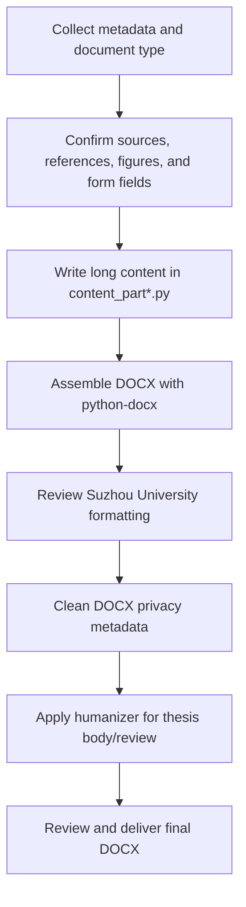

<div align="center">

**English** | [简体中文](./README.md)

</div>

<p align="center">
  
</p>

<h1 align="center">Suda Thesis</h1>

<p align="center">
  <b>Suzhou University thesis document generation skill</b><br>
  <i>DOCX generation workflow for Codex and Claude Code</i>
</p>

<p align="center">
  
  
  
  
</p>

---

## Overview

**Suda Thesis** is an Agent Skill for generating Suzhou University undergraduate thesis-related Word documents. Long documents are written as segmented Python content modules and assembled with `python-docx`, which keeps prose, references, captions, and formatting logic separated.

This repository is a single-source skill package. Codex and Claude Code both use the same `SKILL.md`; Codex UI metadata lives in `agents/openai.yaml`.

> This is not an official Suzhou University template. Always review the generated DOCX against the latest school and department requirements before submission.

## Features

- Segmented long-document workflow for thesis body, literature review, and long literature translation tasks.
- One generic reference scaffold under `scripts/split_pattern/`.
- Support for thesis body, literature review, literature translation, task book, and midterm-check documents.
- Bundled academic humanizer workflow for thesis body and literature review post-processing.
- DOCX metadata cleanup requirements for author, editor, company, manager, title, keywords, and `python-docx` fingerprints.
- Chinese README by default, with this English README as an optional companion.

## Supported Documents

| Document | Generation Pattern | Split Required | Post-Processing |
| --- | --- | --- | --- |
| Thesis body | `scripts/split_pattern/` | Yes | Humanizer required |
| Literature review | Segmented pattern | Yes | Humanizer required |
| Literature translation | Segmented pattern | Required for long papers | Faithful academic fluency review |
| Task book | Table/form script | No | Formal concision |
| Midterm-check form | Table/form script | No | Formal concision |

## Install

### Codex

```bash
git clone https://github.com/jiadizhunine/suda-thesis.git ~/.codex/skills/suda-thesis
```

### Claude Code

```bash
git clone https://github.com/jiadizhunine/suda-thesis.git ~/.claude/skills/suda-thesis
```

### Shared Local Source

To keep Codex and Claude Code on the same local source:

```bash
git clone https://github.com/jiadizhunine/suda-thesis.git ~/skills/suda-thesis
ln -sfn ~/skills/suda-thesis ~/.codex/skills/suda-thesis
ln -sfn ~/skills/suda-thesis ~/.claude/skills/suda-thesis
```

## Usage

Invoke the skill explicitly:

```text
Use $suda-thesis to generate a Suzhou University thesis body DOCX.
```

In practice, start from the topic direction or results you already have:

| Target Document | Materials To Provide | Example Request |
| --- | --- | --- |
| Literature review | Research direction or thesis title | `Use $suda-thesis to generate a Suzhou University literature review DOCX based on my research direction: "...".` |
| Literature translation | Research direction or thesis title; if no source article is provided, search for and verify a real English article first | `Use $suda-thesis to find a real English article for my topic direction, then generate a Suzhou University literature translation DOCX.` |
| Thesis body | Thesis title, experimental/survey results, result figures, captions, methods/materials | `Use $suda-thesis to generate a thesis body DOCX from my title, result figures, and findings.` |
| Task book / midterm-check | Research direction or topic, plus existing results or progress | `Use $suda-thesis to generate the task book and midterm-check form from my topic direction and results.` |

Other examples:

```text
Use $suda-thesis to generate a literature review DOCX.
Use $suda-thesis to generate a literature translation DOCX.
Use $suda-thesis to generate a task book DOCX.
Use $suda-thesis to generate a midterm-check DOCX.
```

## Workflow



## Repository Layout

```text
suda-thesis/
├── SKILL.md
├── agents/openai.yaml
├── assets/
├── references/
├── scripts/split_pattern/
└── skills/humanizer/
```

## Release

- Current release: [`v1.0`](https://github.com/jiadizhunine/suda-thesis/releases/tag/v1.0)
- Repository: [github.com/jiadizhunine/suda-thesis](https://github.com/jiadizhunine/suda-thesis)

## Acknowledgements

- `skills/humanizer/` is adapted from [blader/humanizer](https://github.com/blader/humanizer), originally released by Siqi Chen under the MIT License. This repository keeps the original MIT license text and modifies the workflow for Chinese academic writing and thesis post-processing.

## License

This project is released under the [MIT License](./LICENSE).
