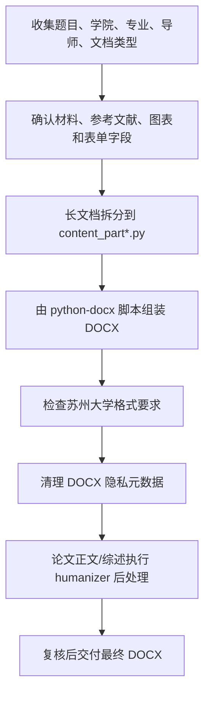

<div align="center">

[English](./README.en.md) | **简体中文**

</div>

<p align="center">
  
</p>

<h1 align="center">Suda Thesis</h1>

<p align="center">
  <b>苏州大学本科毕业论文与相关文档 DOCX 生成 Skill</b><br>
  <i>Suzhou University thesis document generation skill for Codex and Claude Code</i>
</p>

<p align="center">
  
  
  
  
</p>

---

## 简介

**Suda Thesis** 是一个用于生成苏州大学本科毕业论文相关 Word 文档的 Agent Skill。它将论文正文、文献综述、文献翻译等长文档拆成分段 Python 模块，再由 `python-docx` 脚本统一组装为 `.docx`，避免把整篇论文塞进一个巨大脚本里。

这个仓库是一个单一真源 skill 包：Codex 和 Claude Code 都读取同一份 `SKILL.md`，Codex 的展示元数据放在 `agents/openai.yaml`。

> 本项目不是苏州大学官方模板。生成的 DOCX 需要在正式提交前由使用者按学院最新要求人工复核。

## 功能特色

- **分段生成长文档**：论文正文、文献综述、长篇文献翻译使用 `content_part*.py` 分段组织内容。
- **保留一套通用参考脚本**：核心脚手架位于 `scripts/split_pattern/`，便于按不同论文主题改写内容模块。
- **覆盖常见毕设文档**：支持论文正文、文献综述、文献翻译、任务书、中期检查。
- **内置学术人话化流程**：论文正文和文献综述完成后，使用 `skills/humanizer/` 做学术化但不僵硬的润色。
- **DOCX 隐私元数据清理**：要求清理作者、最后修改者、公司、管理者、标题、关键词、`python-docx` 指纹等元数据。
- **中英双语安装说明**：中文为默认 README，英文说明见 [README.en.md](./README.en.md)。

## 支持的文档类型

| 文档 | 生成方式 | 是否强制分段 | 后处理 |
| --- | --- | --- | --- |
| 毕业论文正文 | `scripts/split_pattern/` | 是 | 必须 humanizer |
| 文献综述 | 复用分段模式 | 是 | 必须 humanizer |
| 文献翻译 | 复用分段模式 | 长文强制 | 保持原意，审校学术流畅度 |
| 任务书 | 表格/表单脚本 | 否 | 正式、简洁 |
| 中期检查 | 表格/表单脚本 | 否 | 正式、简洁 |

## 安装方法

### Codex

```bash
git clone https://github.com/jiadizhunine/suda-thesis.git ~/.codex/skills/suda-thesis
```

### Claude Code

```bash
git clone https://github.com/jiadizhunine/suda-thesis.git ~/.claude/skills/suda-thesis
```

### 同时用于 Codex 和 Claude Code

如果你希望两边始终读取同一份本地 skill，可以只 clone 一份，再为另一个工具建立软链接：

```bash
git clone https://github.com/jiadizhunine/suda-thesis.git ~/skills/suda-thesis
ln -sfn ~/skills/suda-thesis ~/.codex/skills/suda-thesis
ln -sfn ~/skills/suda-thesis ~/.claude/skills/suda-thesis
```

## 使用方法

在 Codex 或 Claude Code 中直接点名使用 skill：

```text
Use $suda-thesis to generate a Suzhou University thesis body DOCX.
```

实际使用时，通常从题目方向或已有结果发起：

| 目标文档 | 需要提供的材料 | 示例请求 |
| --- | --- | --- |
| 文献综述 | 研究方向或论文题目 | `使用 $suda-thesis，根据我的研究方向“……”生成苏州大学文献综述 DOCX。` |
| 文献翻译 | 研究方向或论文题目；如未提供原文，先查找并核验一篇真实存在的英文文章 | `使用 $suda-thesis，根据我的题目方向“……”找一篇真实英文文献，并生成苏州大学文献翻译 DOCX。` |
| 毕业论文正文 | 论文题目、实验/调研结果、结果图、图注、方法材料 | `使用 $suda-thesis，根据题目“……”和这些结果图生成毕业论文正文 DOCX。` |
| 任务书/中期检查 | 论文题目或研究方向、已有结果或完成情况 | `使用 $suda-thesis，根据我的题目方向“……”和这些结果生成任务书和中期检查表。` |

常见请求：

```text
Use $suda-thesis to generate a literature review DOCX.
Use $suda-thesis to generate a literature translation DOCX.
Use $suda-thesis to generate a task book DOCX.
Use $suda-thesis to generate a midterm-check DOCX.
```

中文也可以：

```text
使用 $suda-thesis，根据我的研究方向生成文献综述 DOCX。
使用 $suda-thesis，根据我的题目方向找一篇真实英文文献，并生成文献翻译 DOCX。
使用 $suda-thesis，根据我的论文题目、实验结果和结果图生成毕业论文正文 DOCX。
使用 $suda-thesis，根据我的题目方向和已有结果生成任务书和中期检查表。
```

## 工作流程



## 项目结构

```text
suda-thesis/
├── SKILL.md
├── agents/openai.yaml
├── assets/
│   ├── icon-large.png
│   └── icon-small.png
├── references/
│   ├── format-standards.md
│   ├── forms.md
│   └── pitfalls.md
├── scripts/split_pattern/
└── skills/humanizer/
```

## 发布状态

- 当前版本：[`v1.0`](https://github.com/jiadizhunine/suda-thesis/releases/tag/v1.0)
- 仓库地址：[github.com/jiadizhunine/suda-thesis](https://github.com/jiadizhunine/suda-thesis)

## 致谢

- `skills/humanizer/` 基于 [blader/humanizer](https://github.com/blader/humanizer) 改写，原项目由 Siqi Chen 发布并采用 MIT License。本仓库保留其 MIT 许可证文本，并在此基础上调整为更适合中文学术写作和毕业论文后处理的版本。

## 许可证

本项目采用 [MIT License](./LICENSE) 开源。
